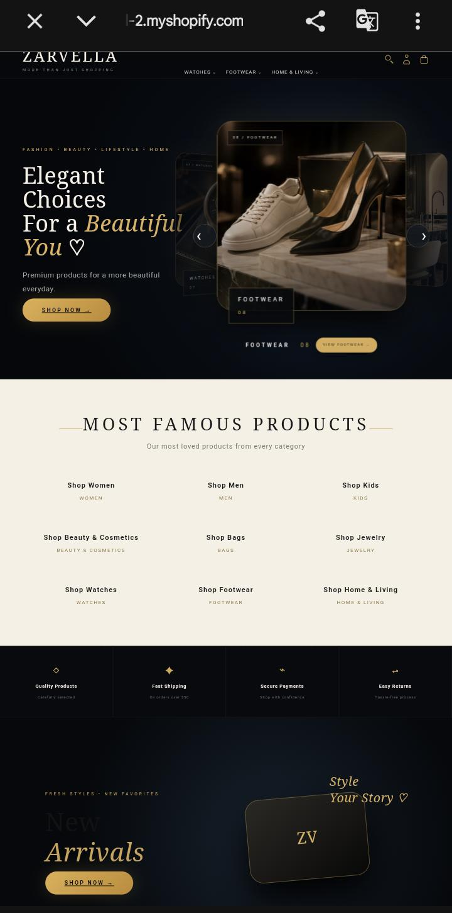

# 🛍️ Advanced AI-Assisted Custom Shopify Theme

Welcome to my professional custom Shopify theme project. This theme was fully designed, coded, and optimized using advanced prompt engineering and AI-assisted development tools to bridge modern e-commerce needs with high-performance execution.

## 🚀 Live Demo
Experience the fully functional store interface live here:
👉 [**Click Here to View Live Shopify Store**](https://zarvella-mall-2.myshopify.com)

---

## 📸 Interface Preview & Screenshots

### 🖥️ Desktop Homepage View

### 📱 heel category View

---

## 🛠️ Core Features Developed
* **AI-Optimized Architecture:** Clean Liquid, HTML5, CSS3, and JavaScript logic generated and debugged through advanced prompt models.
* **100% Responsive Design:** Smooth cross-device compatibility, tailored specifically for mobile-first commercial traffic.
* **Custom Dynamic Sections:** Built reusable drag-and-drop custom blocks inside the Shopify theme editor.
* **Speed & Performance:** Highly compressed assets and optimized layout flow for ultra-fast loading times.

## 👨‍💻 Tech Stack Used
* **Liquid** (Shopify's Templating Language)
* **HTML5 / CSS3 / JavaScript**
* **AI Tooling** (Prompt Engineering, Code Refinement & Debugging)
* **Git / GitHub** (Version Control & Repository Management)
